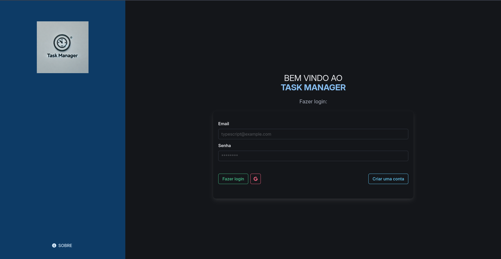

# Task Manager



## Descrição

O Task Manager é uma aplicação de gerenciamento de tarefas desenvolvida com Vue.js, TypeScript e Firebase. A aplicação permite aos usuários criar, visualizar e excluir tarefas. Cada tarefa pode ser descrita e acompanhada por um cronômetro.

## Funcionalidades

- **Autenticação de Usuário**: Utiliza Firebase Authentication para gerenciamento de usuários.
- **Gerenciamento de Tarefas**: Adicione, visualize e exclua tarefas.
- **Persistência de Dados**: Armazena tarefas no Firebase Firestore, garantindo que os dados sejam persistidos e associados a cada usuário.

## Tecnologias Utilizadas

- **Vue.js 3**: Framework para construção da interface do usuário.
- **Firebase**:
  - **Authentication**: Para gerenciamento de autenticação de usuários.
  - **Firestore**: Para armazenamento e gerenciamento de tarefas.
- **TypeScript**: Para garantir tipagem estática e maior robustez no código.
- **Bulma**: Framework CSS para estilização da aplicação.

## Estrutura do Projeto

- `public/`: Arquivos públicos estáticos como favicon e imagens.

- `src/`: Código-fonte principal da aplicação.

  - `assets/`: Recursos estáticos como imagens ou fontes.

  - `components/`: Componentes Vue reutilizáveis.

  - `firebase/`: Configuração do Firebase.

  - `interfaces/`: Definições de tipos TypeScript.

  - `router/`: Configuração de rotas da aplicação.

  - `services/`: Serviços para lógica de negócios, como interações com o Firebase.

  - `utils/`: Funções utilitárias e auxiliares.

  - `views/`: Componentes Vue que representam páginas ou visualizações completas.

  - `App.vue`: Componente raiz da aplicação.

  - `main.ts`: Ponto de entrada da aplicação.

- `.env.local`: Variáveis de ambiente locais.

## Configuração

### Instalação

1. Clone o repositório:

   ```bash
   git clone https://github.com/gabriel04alves/task-manager-vuejs.git
   ```

2. Navegue até o diretório do projeto:

   ```bash
   cd task-manager-vuejs
   ```

3. Instale as dependências:

   ```bash
   npm install
   ```

4. Configure as variáveis de ambiente:
   - Crie um arquivo `.env` na raiz do projeto e adicione suas credenciais do Firebase:
     ```env
     VITE_FIREBASE_API_KEY=your-api-key
     VITE_FIREBASE_AUTH_DOMAIN=your-auth-domain
     VITE_FIREBASE_PROJECT_ID=your-project-id
     VITE_FIREBASE_STORAGE_BUCKET=your-storage-bucket
     VITE_FIREBASE_MESSAGING_SENDER_ID=your-messaging-sender-id
     VITE_FIREBASE_APP_ID=your-app-id
     ```

### Execução

Para iniciar a aplicação em modo de desenvolvimento:

```bash
npm run dev
```

Para criar uma versão de produção da aplicação:

```bash
npm run build
```

## Contribuição

Contribuições são bem-vindas! Se você quiser contribuir, por favor, siga estas etapas:

1. Faça um fork do repositório.
2. Crie uma nova branch para sua feature (`git checkout -b feature/nova-feature`).
3. Faça suas alterações e faça commit (`git commit -am 'Adiciona nova feature'`).
4. Envie para o repositório remoto (`git push origin feature/nova-feature`).
5. Crie um pull request.

## Licença

Distribuído sob a licença MIT. Veja `LICENSE` para mais informações.

## Deploy

Link do Projeto: [task-manager-vuejs.vercel.app
](https://task-manager-vuejs.vercel.app)

## Créditos

A aplicação foi inspirada em um projeto desenvolvido na Alura durante um curso de Vue.js. Além disso, o vídeo [“Vue 3 + Firebase Authentication in 10 Minutes”](https://youtu.be/xceR7mrrXsA?feature=shared) do canal LearnVue no YouTube colaborou efetivamente com o desenvolvimento desta aplicação.
